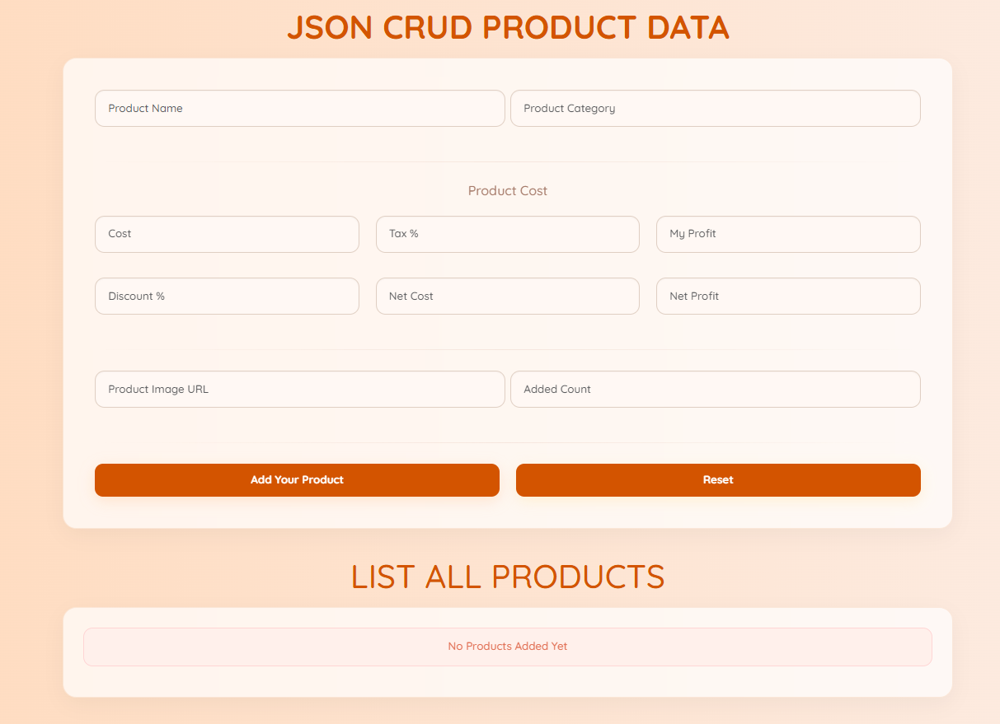

# JSON CRUD Product App

### Project Screenshot

This is a simple single-page application for a Product Management system built with just HTML, CSS, and vanilla JavaScript. You can use it to add new products, view them, update their details, or delete them.

## Features

-   **Create:** Add a new product with all its details (name, category, costs, discounts).
-   **Read:** Display all products in a clean, readable table.
-   **Update:** Edit the information of any existing product.
-   **Delete:** Remove individual products or clear the entire list at once.
-   **Data Persistence:** Data is saved in your browser's `localStorage`, so your products won't be lost if you refresh the page.

## How to Run

1.  Download the project files.
2.  Open the `index.html` file directly in your web browser (e.g., Google Chrome or Firefox).
